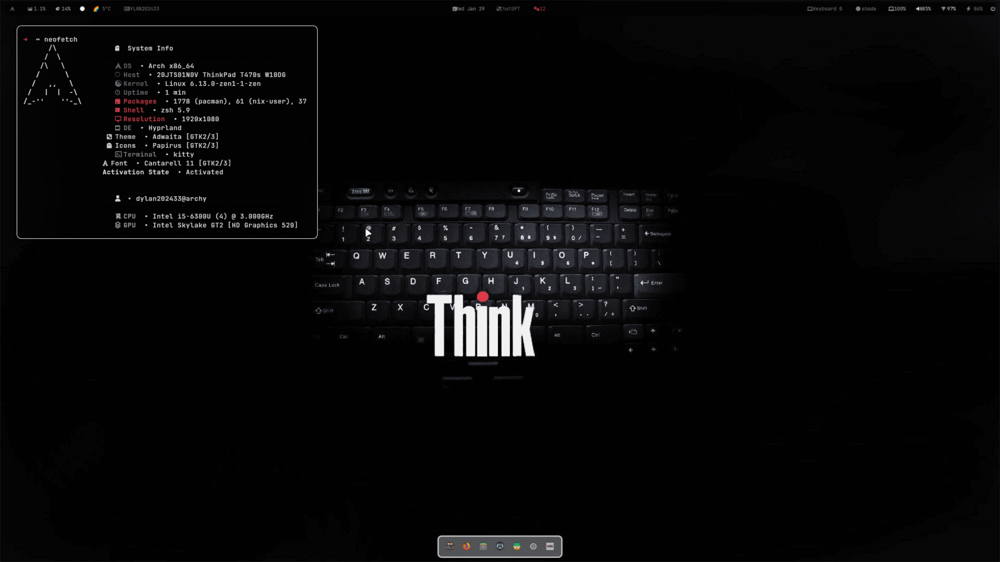

dotfile for thinkpads based on ml4w and dylan202433 dotfiles
Installation guide 
First Install Hyprland depend on what distro you use
```zsh
yay -S hyprland-git #sudo pacman -S hyprland
```
Now install the ML4W dotfiles (while installing ml4w do not restart
```zsh
yay -S ml4w-hyprland
ml4w-hyprland-setup
```
Install the base setups
```zsh
yay -S waybar rofi dunst kitty swaylock-fancy-git swayidle pamixer light brillo cmake meson cpio pkg-config waypaper hyprpolkitagent && sudo pacman -S python python-pip waybar cliphist swww power-profiles-daemon
```
Required Fonts

https://github.com/ryanoasis/nerd-fonts/releases/download/v2.2.2/JetBrainsMono.zip

https://github.com/ryanoasis/nerd-fonts/releases/download/v2.3.3/Iosevka.zip
```zsh
yay -S ttf-font-awesome
```
Once you download them and unpack them, place them into ~/.fonts or ~/.local/share/fonts.

Then run this command for your system to detect the newly installed fonts.
```zsh
fc-cache -fv
```
Now copy the dotfile
```zsh
git clone https://github.com/dylan202433/The-Thinkpad-dotfiles.git
cd The-Thinkpad-dotfiles
sudo cp -r ./config/* ~/.config/
```
If there any error pls report in the issue

NOTE

SOME FEATURE WONT WORK ON THE ML4W SETTING

IF YOU UPDATE ML4W YOU HAVE TO REDO THIS BUT ONLY THE COPY THE DOTFILES 

Common issue

Wont Copy?

delete the directory like hypr, ags , etc 
try 
```zsh
cd ~/.config 
sudo rm -r ags bashrc dunst fastfetch gtk-3.0 gtk-4.0 hypr kitty ml4w nvim nwg-dock-hyprland ohmyposh qt6ct rofi wal waybar waypaper wlogout xsettingsd zshrc
```
and then try to copy again
